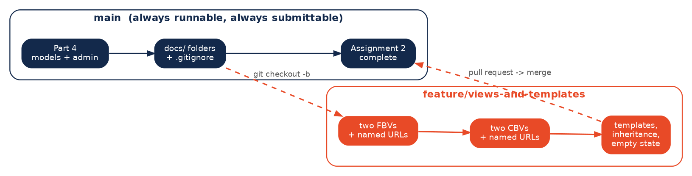

# Branching Strategy

**Team Career Coaches (Group 11) | Beacon**



*(Source: `branching_strategy.dot`. Regenerate with
`dot -Tpng -Gdpi=140 branching_strategy.dot -o diagram.png`.)*

---

## The rule

`main` is never worked on directly. Every piece of work happens on a branch cut
from `main`, and comes back through a pull request. The reason is practical
rather than ceremonial: three people are editing one Django project, and a broken
`main` means nobody on the team can run the app or submit it.

So `main` holds one guarantee - **it runs, and it is submittable as-is.** If a
deadline arrives while a feature is half-finished, the unfinished work sits on
its branch and `main` is still a valid submission.

## Branch naming

```
feature/<short-description>     new functionality      feature/views-and-templates
fix/<short-description>         something is broken    fix/empty-state-colspan
docs/<short-description>        documentation only     docs/branching-strategy
```

Lowercase, hyphen-separated, no personal names. The branch is named after the
work, not the person doing it, so it still reads clearly six weeks later.

## The cycle

```bash
# 1. start from a current main
git checkout main
git pull origin main

# 2. cut the branch
git checkout -b feature/views-and-templates

# 3. commit as you go, in small pieces
git add preparation/views.py preparation/urls.py
git commit -m "Add two function-based views with named URL routes"

# 4. publish the branch
git push -u origin feature/views-and-templates

# 5. open a pull request on GitHub, then merge it into main
```

Step 5 is deliberately done through GitHub rather than a local `git merge`. The
pull request leaves a permanent, readable record of what the branch contained
and when it landed - which a local merge does not.

## Commit messages

Imperative mood, one logical change per commit:

- `Add generic ListView for plan tasks`
- `Fix empty-state colspan on the skill table`
- `Document branching strategy`

Not `update`, `fix stuff`, or `final final v2`. A commit message is the only
explanation a teammate gets when they run `git log` to work out when something
changed.

## Who owns what

Each feature area maps to one app-level module, so two people rarely edit the
same file:

| Area | Files | Owner |
|---|---|---|
| Resume and goal intake | `preparation/views.py` (intake views), Screen 1 templates | Manavi |
| Skills diagnosis | assessment views, Screen 2 templates | Meet |
| Plan generator | plan views, Screen 3 templates | Chu-Yun |
| Progress tracking | task views, Screen 4 templates | Shared |

**Why one area is shared.** There are four feature areas and three of us, so
Progress tracking is not owned by one person. Anyone picking up task views or
Screen 4 templates says so in `docs/notes/notes.txt` before branching, so two
people never start the same piece of work.

Shared files - `beacon_core/settings/`, `preparation/models.py`,
`templates/base.html` - are changed in their own small branches and merged
quickly, so they never sit in conflict for long.

## Conflict handling

If `main` has moved ahead while a branch was in progress:

```bash
git checkout main && git pull origin main
git checkout feature/my-branch
git merge main          # resolve conflicts here, on the branch
```

Conflicts are resolved on the feature branch, never on `main`. That keeps a
messy resolution out of the branch everyone else pulls from.
